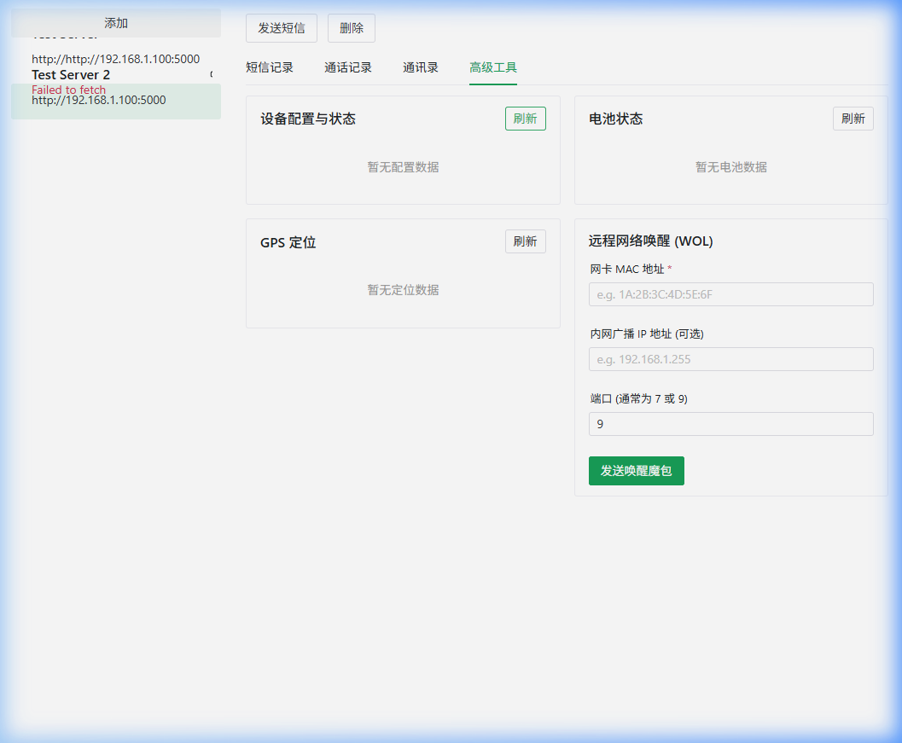
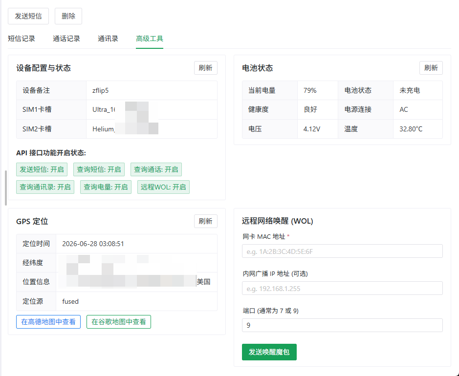

# SmsForwarderClient

为 [SmsForwarder](https://github.com/pppscn/SmsForwarder) 设计的跨平台桌面客户端，基于 Vite + Vue3 + Tauri 构建。

[在线使用](https://wzqvip.github.io/SmsForwarderClient/) （HTTPS 访问时不支持连接非 HTTPS 服务器）

---

## 🚀 主要功能 (v3.0+)

1. **接口安全签名**: 支持对请求和应答进行动态 `HmacSHA256` 算法签名校验，适配服务端“安全设置-校验签名”配置。
2. **多功能控制面板**:
   - **短信记录**: 查看短信列表，包含发件号码、短信内容、接收时间，自动根据 `sub_id` / `sim_info_list` 识别并展示 **卡槽备注** (如：`SIM1 (xxxx)`)。
   - **通话记录**: 远程拉取通话记录，支持通话类型筛选 (呼入/呼出/未接) 与号码模糊搜索。
   - **通讯录管理**: 模糊搜索手机通讯录中的联系人，并支持远程新增联系人。
   - **高级工具箱**:
     - **电量监测**: 显示电池百分比、充电状态、健康度、当前电压及温度。
     - **GPS 定位**: 查看设备最新定位时间、精细经纬度、网络/GPS 信号源、逆地址，并支持一键跳转高德地图定位查看。
     - **远程网络唤醒 (WOL)**: 快速向局域网主机发送网络唤醒魔包 (Magic Packet)。
     - **设备配置信息**: 查询服务端各项接口功能开启状态以及插卡 SIM 卡槽配置。

## 📸 界面预览





---

## 🛠️ 编译与开发指南

本项目基于 Node.js 环境，使用 `npm` 进行依赖管理和编译。

### 1. 安装依赖

在项目根目录下执行以下命令：

```bash
npm install
```

### 2. 启动本地开发服务 (Vite Web 端)

```bash
npm run dev
```

本地运行后可直接打开浏览器访问 `http://localhost:5173`。

### 3. 编译打包网页静态资源 (Web Production Build)

```bash
npm run build
```

打包生成的文件将保存在 `dist/` 目录下。

### 5. GitHub Pages 自动部署

仓库已配置 `.github/workflows/deploy-pages.yml`，会在以下场景自动重新构建并发布站点：

- `main` 分支有新提交时；
- 仓库出现新评论时（`issue_comment.created`）；
- 手动触发 `workflow_dispatch`。

### 4. 运行 / 编译 Tauri 桌面客户端

本项目包含 Tauri 框架支持，可编译为多端原生桌面应用：

- **启动桌面开发版**:
  ```bash
  npm run tauri dev
  ```
- **打包桌面安装包 (Windows/macOS/Linux)**:
  ```bash
  npm run tauri build
  ```
